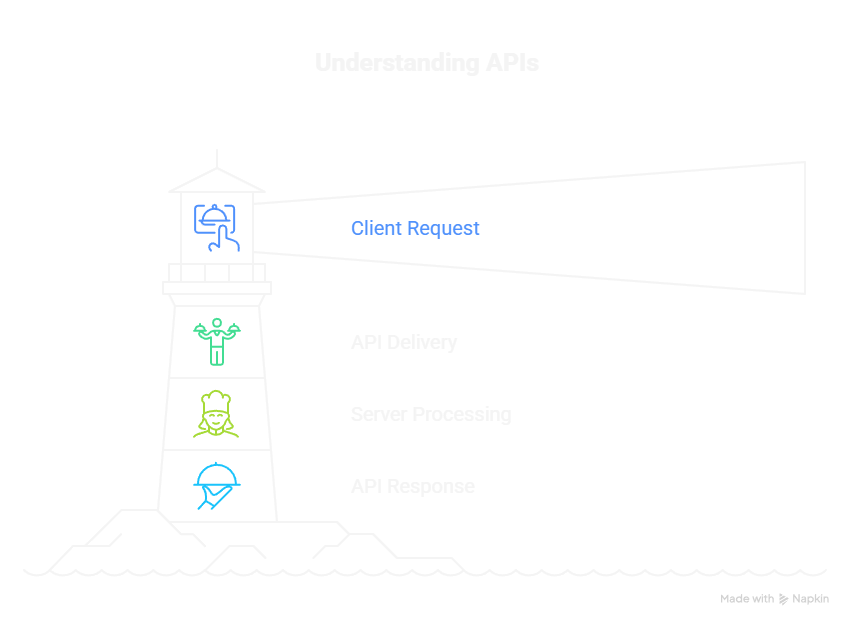
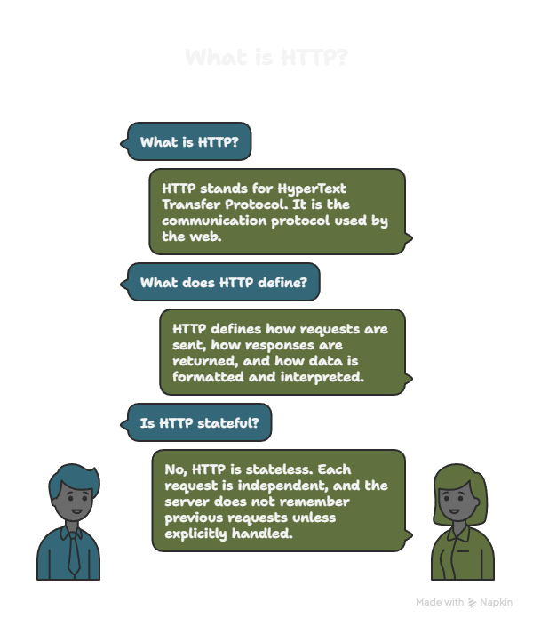
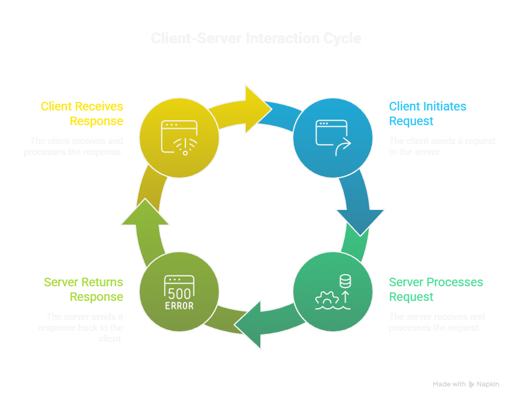
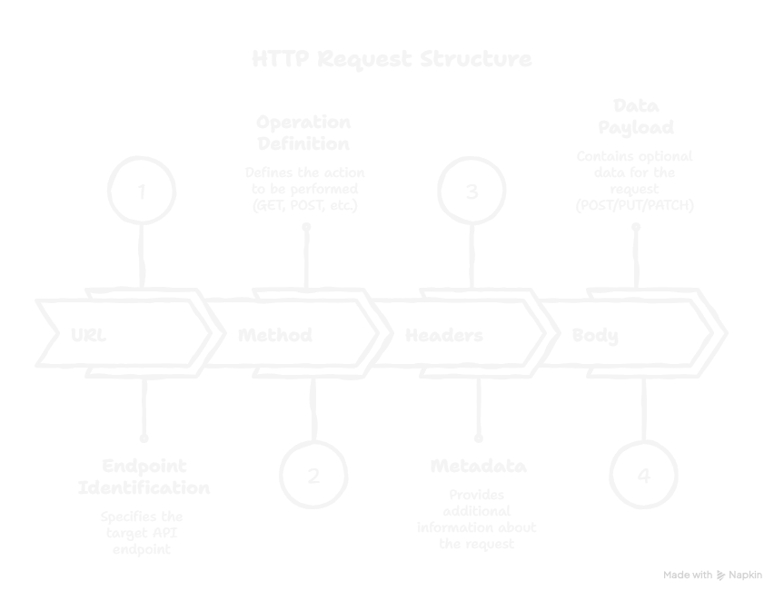
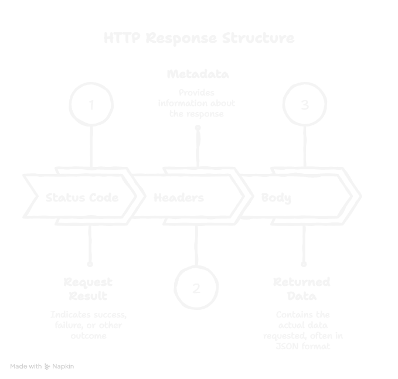
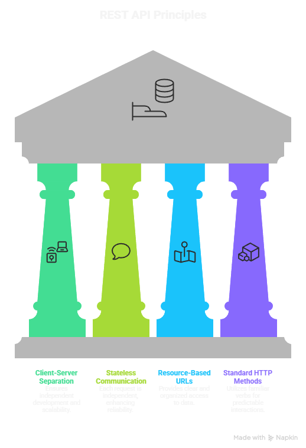
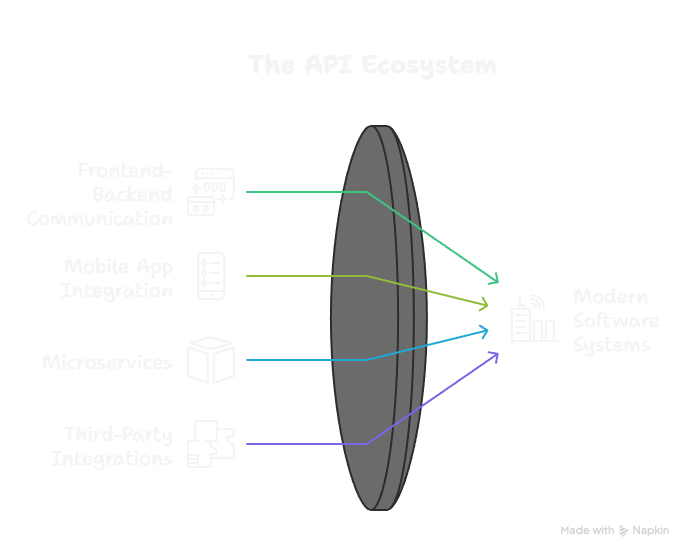

# Day 01: HTTP & API Fundamentals

This document covers the essentials of HTTP and APIs, serving as the foundation for my learning journey.


## 🌍 English Version

## 1. What is an API?

API stands for **Application Programming Interface**. An API is a mechanism that allows two software systems to communicate with each other in a standardized way.

Instead of directly accessing a system’s internal logic or database, clients interact with it through predefined rules (endpoints).

**Real-life analogy:**
An API is like a waiter in a restaurant:

* You (client) request food
* The waiter (API) delivers the request to the kitchen (server)
* The kitchen prepares the food (processing)
* The waiter returns the result (response)

APIs enforce structure, security, and consistency.



---

## 2. What is HTTP?

HTTP stands for **HyperText Transfer Protocol**. It is the communication protocol used by the web.

HTTP defines:

* How requests are sent
* How responses are returned
* How data is formatted and interpreted

HTTP is **stateless**, meaning:

* Each request is independent
* The server does not remember previous requests unless explicitly handled (sessions, tokens)

---


## 3. Client – Server Architecture

### Client

The **client** initiates requests.
Examples:

* Browser
* Postman
* Mobile app
* Frontend (React, Vue)

### Server

The **server** processes requests and returns responses.
Examples:

* FastAPI
* Django
* Flask
* Node.js

Communication flow:

```
Client → HTTP Request → Server → HTTP Response → Client
```

---



## 4. Endpoint

An **endpoint** is a specific URL that accepts requests.

Example:

```
GET /users
```

Each endpoint:

* Has a URL path
* Supports one or more HTTP methods
* Performs a specific task

Endpoints represent **resources**, not actions.

---

## 5. HTTP Methods (Verbs)

### GET

* Retrieves data
* Does NOT modify server state

Example:

```
GET /users
```

---

### POST

* Creates new data
* Sends data in the request body

Example:

```
POST /users
```

---

### PUT

* Updates an existing resource (entire replacement)

---

### PATCH

* Partially updates a resource

---

### DELETE

* Removes a resource

---

## 6. Request Structure

An HTTP request consists of:

### 1. URL

Identifies the endpoint.

### 2. Method

Defines the operation (GET, POST, etc.).

### 3. Headers

Metadata about the request.

Common headers:

* `Content-Type`
* `Authorization`
* `Accept`

### 4. Body

Optional data payload (mostly POST/PUT/PATCH).

---




## 7. Response Structure

An HTTP response includes:

### 1. Status Code

Indicates result of the request.

### 2. Headers

Metadata about the response.

### 3. Body

Returned data (often JSON).

---



## 8. HTTP Status Codes

### 2xx – Success

* `200 OK`
* `201 Created`

### 4xx – Client Errors

* `400 Bad Request`
* `401 Unauthorized`
* `403 Forbidden`
* `404 Not Found`

### 5xx – Server Errors

* `500 Internal Server Error`

---

## 9. What is JSON?

JSON stands for **JavaScript Object Notation**.

It is a lightweight data-interchange format used by APIs.

Example:

```json
{
  "id": 1,
  "name": "John",
  "email": "john@example.com"
}
```

Rules:

* Key-value pairs
* Keys are strings
* Uses `{}` and `[]`

---

## 10. REST API

REST stands for **Representational State Transfer**.

REST principles:

* Client-server separation
* Stateless communication
* Resource-based URLs
* Standard HTTP methods

REST APIs are predictable and scalable.

---




## 11. Authentication vs Authorization

### Authentication

Verifies **who you are**.
Examples:

* Username & password
* Tokens

### Authorization

Determines **what you can access**.

---

## 12. Headers Explained

### Content-Type

Specifies data format.
Example:

```
application/json
```

### Authorization

Used for security.
Example:

```
Authorization: Bearer <token>
```

---

## 13. Postman

Postman is an API testing tool.

Allows you to:

* Send HTTP requests
* Inspect responses
* Debug APIs

Postman acts as a **client simulator**.

---

## 14. Why APIs Are Critical

APIs enable:

* Frontend ↔ Backend communication
* Mobile app integration
* Microservices
* Third-party integrations

Modern software systems are API-driven.

---



## 15. What Comes Next?

Next steps after Day 01:

* Hands-on GET requests
* Query parameters
* Request headers in practice
* Error handling

Day 01 builds the **foundation** for everything that follows.


---

---

## 🇹🇷 Türkçe Versiyon

<details>
<summary><b>Türkçe içeriği okumak için buraya tıklayın (Click to expand)</b></summary>

<br>

Bu doküman, API öğrenme yolculuğumun **1. günü** kapsamında, HTTP ve API kavramlarını **en temel seviyeden**, hiçbir boşluk bırakmadan anlamak amacıyla hazırlanmıştır. Teknik terimlerin tamamı sade bir dille açıklanmış, gerektiğinde örneklerle desteklenmiştir.

---

## 1. API Nedir?

**API (Application Programming Interface)**, iki yazılımın birbiriyle **nasıl konuşacağını** belirleyen kurallar bütünüdür.

### Basit Tanım

API, bir yazılımın başka bir yazılıma:

* Ne isteyebileceğini
* Nasıl isteyeceğini
* Karşılığında ne alacağını

söyler.

### Günlük Hayat Benzetmesi

* Restoran = Sunucu (Server)
* Menü = API
* Garson = API isteği
* Yemek = API yanıtı (Response)

Sen mutfağa girmezsin, **menü üzerinden** sipariş verirsin. Yazılımlar da sistemin içine girmez, **API üzerinden** konuşur.

---

## 2. HTTP Nedir?

**HTTP (HyperText Transfer Protocol)**, istemci (client) ile sunucu (server) arasında veri alışverişini sağlayan iletişim protokolüdür.

### Protokol Ne Demektir?

Protokol = Tarafların uyması gereken iletişim kuralları

Yani HTTP şunu belirler:

* İstek nasıl gönderilir?
* Yanıt nasıl döner?
* Hata varsa nasıl bildirilir?

---

## 3. Client (İstemci) ve Server (Sunucu)

### Client (İstemci)

İsteği başlatan taraftır.
Örnekler:

* Web tarayıcısı (Chrome)
* Mobil uygulama
* Postman
* Python scripti

### Server (Sunucu)

İstekleri karşılayan ve yanıt dönen taraftır.
Örnekler:

* Web sunucusu
* API sunucusu
* Backend uygulaması

📌 **API öğrenirken genelde Client tarafındayız.**

---

## 4. Request (İstek) Nedir?

Client’ın server’a gönderdiği mesajdır.

Bir HTTP Request şu parçalardan oluşur:

1. HTTP Method
2. URL
3. Headers
4. (Opsiyonel) Body

---

## 5. HTTP Method (HTTP Metodu)

HTTP metodları, **isteğin amacını** belirtir.

### En Temel Metodlar

#### GET

* Veri almak için kullanılır
* Server’daki veriyi **değiştirmez**

Örnek:

```
GET /users
```

#### POST

* Yeni veri göndermek / oluşturmak için

```
POST /users
```

#### PUT

* Var olan verinin **tamamını** güncellemek için

#### PATCH

* Var olan verinin **bir kısmını** güncellemek için

#### DELETE

* Veri silmek için

---

## 6. URL Nedir?

**URL (Uniform Resource Locator)**, erişilmek istenen kaynağın adresidir.

Örnek:

```
https://jsonplaceholder.typicode.com/posts
```

### URL Parçaları

* https → Protokol
* jsonplaceholder.typicode.com → Domain (sunucu adresi)
* /posts → Endpoint (kaynak)

---

## 7. Endpoint Nedir?

Endpoint, API içinde **belirli bir kaynağa** karşılık gelen yoldur.

Örnek:

```
GET /posts
GET /users
```

Her endpoint genellikle **bir veri türünü** temsil eder.

---

## 8. Headers (Başlıklar)

Headers, isteğe veya yanıta ait **ek bilgiler** taşır.

### Ne İşe Yarar?

* Veri formatı belirtmek
* Kimlik doğrulama
* Yetkilendirme

### Örnek Header

```
Content-Type: application/json
```

Bu, gönderilen/verilen verinin **JSON formatında** olduğunu söyler.

---

## 9. Body (Gövde)

Body, isteğin içinde gönderilen **asıl veridir**.

📌 Genellikle **POST, PUT, PATCH** isteklerinde bulunur.

### Örnek JSON Body

```json
{
  "name": "Yusuf",
  "age": 23
}
```

---

## 10. Response (Yanıt) Nedir?

Server’ın isteğe karşılık client’a gönderdiği cevaptır.

Bir response şunları içerir:

* Status Code
* Headers
* Body

---

## 11. HTTP Status Code (Durum Kodları)

Status code, isteğin sonucunu belirtir.

### En Yaygın Kodlar

#### 200 OK

İstek başarılı

#### 201 Created

Yeni kaynak oluşturuldu

#### 400 Bad Request

İstek hatalı

#### 401 Unauthorized

Kimlik doğrulama yok

#### 403 Forbidden

Yetki yok

#### 404 Not Found

Kaynak bulunamadı

#### 500 Internal Server Error

Sunucu hatası

---

## 12. JSON Nedir?

**JSON (JavaScript Object Notation)**, API’lerin en sık kullandığı veri formatıdır.

### Özellikleri

* Okunabilir
* Hafif
* Dil bağımsız

### JSON Örneği

```json
{
  "id": 1,
  "title": "API Learning",
  "completed": false
}
```

---

## 13. REST Nedir?

**REST (Representational State Transfer)**, API tasarım yaklaşımıdır.

### REST Temel İlkeleri

* Kaynak odaklıdır
* HTTP metodlarını doğru kullanır
* Stateless’tir

### Stateless Ne Demek?

Server, önceki istekleri **hatırlamaz**.
Her istek kendi başına yeterlidir.

---

## 14. Postman Nedir?

Postman, API’leri test etmek için kullanılan bir **istemci aracıdır**.

### Ne Sağlar?

* API istekleri gönderme
* Yanıtları görme
* Headers / Body düzenleme
* Hata ayıklama

📌 API öğrenirken Postman **olmazsa olmazdır**.

---

## 15. Bu Günün Kazanımları

Bu günün sonunda:

* API’nin ne olduğunu
* HTTP’nin nasıl çalıştığını
* Request / Response mantığını
* Status code’ları
* JSON yapısını

**temelden ve eksiksiz** öğrenmiş oldum.

</details>


