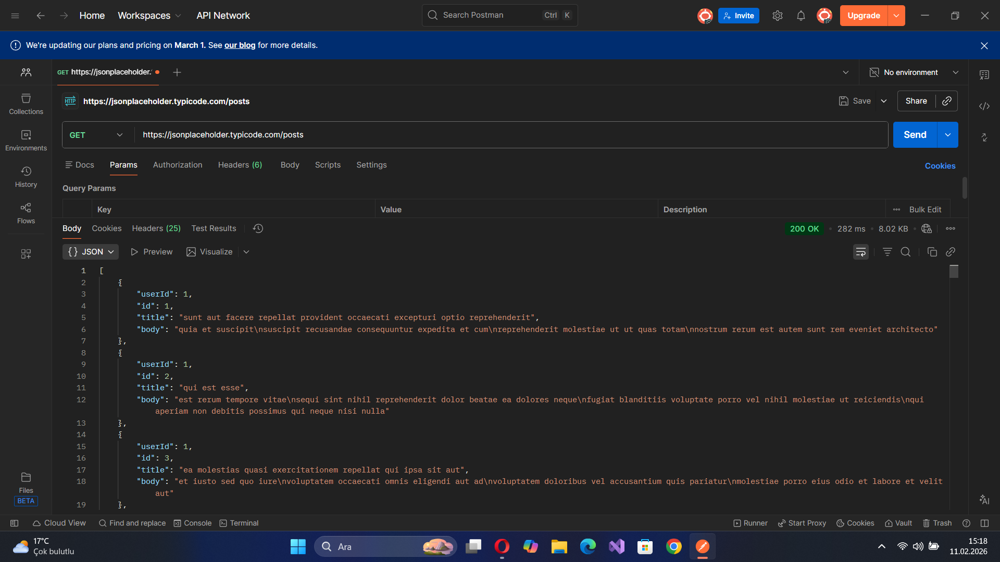
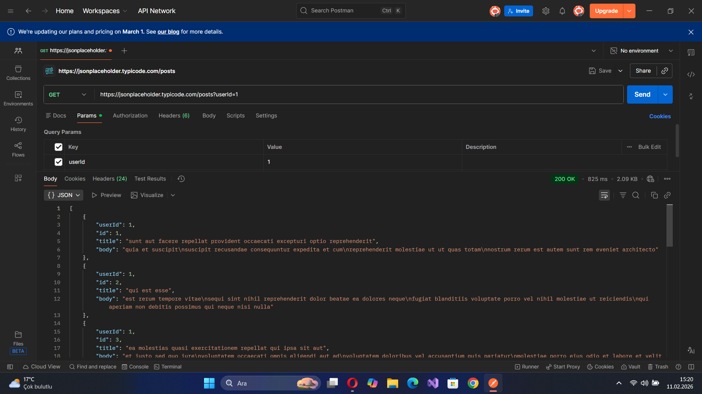
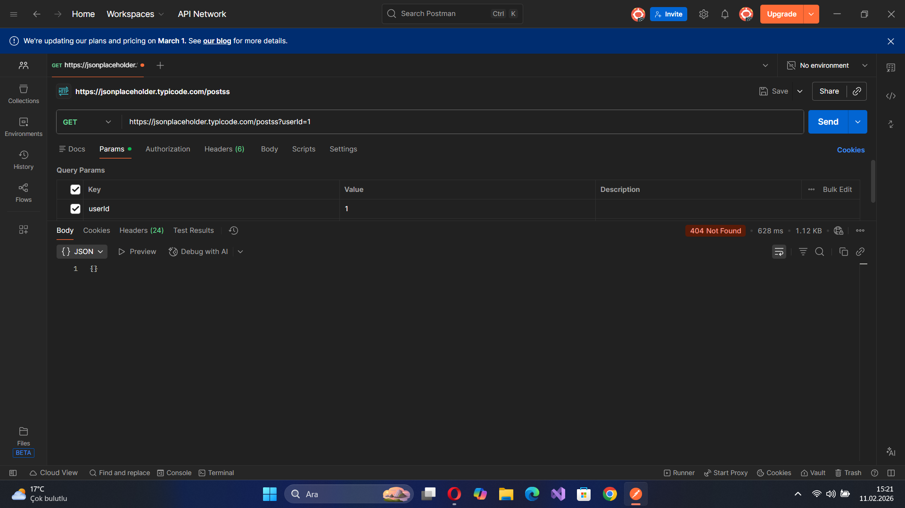

# Day 02: Working with Postman & GET Requests

On the second day of my journey, I moved from theory to practice. I used Postman to see how a client actually communicates with a server in real-time.

---

## 🌍 English Version

### 🎯 What I Aimed For
The goal for today was simple: learn how to use a professional tool to fetch data and understand what the server is telling me through status codes.

### 1. The Tool: Postman
I installed **Postman** to act as my "Client." It’s much easier to see the details of a request here than in a browser. 
* **What I did:** Created a workspace and prepared my first request.

### 2. My First GET Request
I used a test API called **JSONPlaceholder** to pull some data.
* **The Process:** I sent a `GET` request to `https://jsonplaceholder.typicode.com/posts`.
* **Result:** I successfully received a list of 100 blog posts with a `200 OK` status code.

### 3. Using Query Parameters to Filter
I learned that I don't always have to pull all the data. I can filter it using parameters.
* **The Step:** I added `userId=1` in the `Params` tab.
* **Result:** The URL changed to `.../posts?userId=1`, and I only received posts belonging to that specific user.

### 4. Observing Errors (404 Not Found)
I also wanted to see what happens when something goes wrong. 
* **The Step:** I typed a wrong address (`/postss`) on purpose.
* **Result:** The server gave me a `404 Not Found` error. This helped me understand that every request has a specific response code.

---

## 🇹🇷 Türkçe Versiyon

<b>Türkçe içeriği okumak için buraya tıklayın (Click to expand)</b>

 

### 🎯 Bugünün Amacı
Bugün ana hedefim basitti: Profesyonel bir araç kullanarak bir sunucudan veri çekmek ve gelen yanıtların (durum kodlarının) ne anlama geldiğini kavramak.

### 1. Araç: Postman
İsteklerimi göndermek için bir "İstemci" (Client) görevi gören **Postman**'i kurdum. İstek detaylarını burada görmek tarayıcıya göre çok daha kolay.

### 2. İlk GET İsteğim
Veri çekmek için **JSONPlaceholder** adlı test servisini kullandım.
* **Süreç:** `https://jsonplaceholder.typicode.com/posts` adresine bir `GET` isteği gönderdim.
* **Sonuç:** 100 maddelik bir listeyi `200 OK` koduyla birlikte başarıyla aldım.

### 3. Filtreleme: Sorgu Parametreleri
İhtiyacım olan veriye odaklanmak için parametreleri kullanmayı öğrendim.
* **İşlem:** `Params` sekmesine giderek `userId=1` değerini ekledim.
* **Sonuç:** URL `.../posts?userId=1` haline geldi ve sunucu sadece bu kullanıcıya ait verileri döndürdü.

### 4. Hataları Gözlemleme (404 Not Found)
İşler ters gittiğinde ne olduğunu görmek için adresi bilerek yanlış yazdım (`/postss`).
* **Sonuç:** Sunucudan `404 Not Found` yanıtını aldım. Bu sayede her isteğin kendine has bir cevap kodu olduğunu bizzat gördüm.

---

## 🏁 Summary of Day 02
* Sent my first real API request.
* Filtered data using parameters.
* Saw how status codes (200, 404) work in practice.