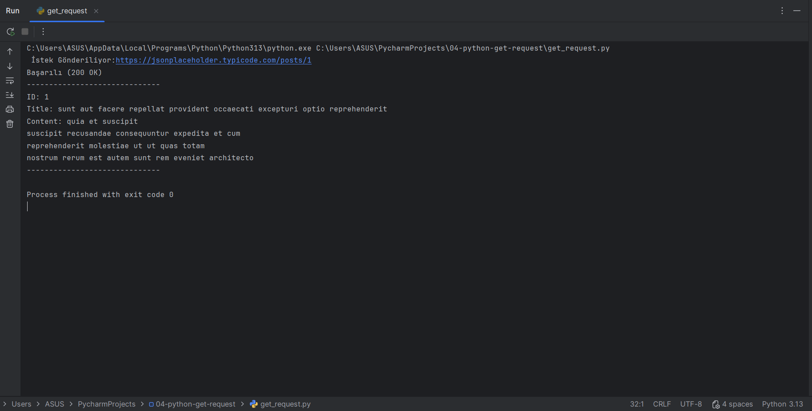

# Day 04: Automating API Requests with Python

On the fourth day, I successfully transitioned from manual testing in Postman to automated data fetching using Python.

---

## 🌍 English Version

### 🎯 Objective
The goal was to learn how to interact with APIs programmatically using Python's `requests` library, moving away from GUI-based tools.

### 🛠️ Tech Stack
* **Language:** Python 3.13 🐍
* **Library:** `requests`
* **IDE:** PyCharm

### 💻 Implementation Steps
1. **Environment Setup:** Installed the `requests` library via pip.
2. **Code Development:** Wrote a script to send a **GET** request to JSONPlaceholder.
3. **Data Parsing:** Handled the JSON response and extracted specific fields like `ID`, `Title`, and `Body`.
4. **Validation:** Confirmed the **201 OK** status code directly in the console.

### 📊 Console Output
The terminal output confirms the successful connection and data retrieval:

---

## 🇹🇷 Türkçe Versiyon

<b>Türkçe içeriği okumak için buraya tıklayın (Click to expand)</b>

 

### 🎯 Hedef
Bu çalışmada, API etkileşimlerini manuel araçlardan (Postman) kod seviyesine taşıyarak Python'un `requests` kütüphanesini kullanmayı öğrendim.

### 🛠️ Kullanılan Teknolojiler
* **Dil:** Python 3.13 🐍
* **Kütüphane:** `requests`
* **Geliştirme Ortamı:** PyCharm

### 💻 Uygulama Adımları
1. **Ortam Kurulumu:** Terminal üzerinden `requests` kütüphanesini kurdum.
2. **Kod Yazımı:** JSONPlaceholder adresine **GET** isteği gönderen bir script hazırladım.
3. **Veri Ayrıştırma:** Gelen JSON yanıtını işleyerek `ID`, `Başlık` ve `İçerik` gibi alanları ayıkladım.
4. **Doğrulama:** Konsol üzerinden **200 OK** durum kodunu ve verileri başarıyla görüntüledim.

### 📊 Konsol Çıktısı
Terminal çıktısı, başarılı bağlantıyı ve verinin çekildiğini kanıtlamaktadır:

---

## 🏁 Summary of Day 04
* ✅ Replaced manual testing with Python automation.
* ✅ Mastered basic error handling and JSON parsing in Python.
* ✅ Successfully fetched and displayed real-time API data in the console.