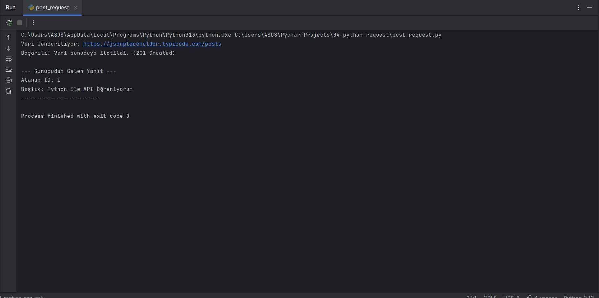

# Python API Automation: GET & POST Requests
On the fourth day of my journey, I transitioned from manual testing in Postman to full programmatic automation using Python. I developed scripts to both fetch (GET) and create (POST) data, bridging the gap between GUI tools and software engineering.

🌍 English Version
🎯 Objective & Postman Comparison
The goal was to automate API interactions that were previously done manually in Postman. While Postman is a great sandbox, Python's requests library allows us to integrate these operations into real-world applications, automate repetitive tasks, and process data at scale.

🛠️ Tech Stack
Language: Python 3.13 🐍

Library: requests

IDE: PyCharm

💻 Implementation Steps
Part 1: Data Fetching (GET Request):

Environment Setup: Installed the requests library via terminal using pip install requests.

Script Development: Wrote a script to send a GET request to a specific resource (posts/1) on JSONPlaceholder.

Data Parsing: Converted the server's response into a Python dictionary using response.json() and extracted fields like ID and Title.

Validation: Confirmed the 200 OK status code directly in the console.

Part 2: Data Submission (POST Request):

Payload Preparation: Created a Python dictionary (payload) containing title, body, and userId to be sent to the server.

Request Dispatch: Used the requests.post() method and the json= parameter to transmit the data automatically in JSON format.

Dynamic Verification: Analyzed the response to verify the system-assigned id: 101 and the original userId: 1.

Result Validation: Confirmed the 201 Created status code, indicating a successful entry creation.

💡 Engineering Tricks & Insights
Auto-Increment Logic: When posting, even if userId: 1 is sent, the server returns id: 101. This is because the server automatically assigns a unique sequence number to every new record.

The Bracket Secret: In Python, API responses are handled as Dictionaries. Using square brackets like result['id'] is the mandatory syntax to access specific "Keys" within that data block.

ID vs UserID: result['id'] gives the system-generated ID (101), whereas result['userId'] returns the ID of the user who created the post (1).

🇹🇷 Türkçe Versiyon

<b>Türkçe içeriği okumak için buraya tıklayın (Click to expand)</b>

🎯 Hedef ve Postman Kıyaslaması
Bu çalışmada, Postman üzerinden manuel yaptığım API işlemlerini Python scriptleri ile tam otomatik hale getirdim. Postman keşif aşaması için mükemmel olsa da, Python otomasyonu veriyi doğrudan yazılımlara entegre etmemize ve büyük veri setlerini saniyeler içinde işlememize olanak tanır.

🛠️ Kullanılan Teknolojiler
Dil: Python 3.13 🐍

Kütüphane: requests

Geliştirme Ortamı: PyCharm

💻 Uygulama Adımları
1. Bölüm: Veri Çekme (GET Request):

Ortam Kurulumu: Terminal üzerinden pip install requests komutuyla kütüphane kurulumunu yaptım.

Sorgu Oluşturma: JSONPlaceholder adresindeki belirli bir kaynağa GET isteği gönderen bir script hazırladım.

Veri Ayrıştırma: Sunucudan gelen JSON yanıtını response.json() ile Python sözlük yapısına dönüştürüp ID ve Başlık alanlarını ayıkladım.

Doğrulama: Konsol üzerinden 200 OK durum kodunu başarıyla görüntüledim.

2. Bölüm: Veri Gönderme (POST Request):

Veri Bloğu Hazırlama: Sunucuya gönderilmek üzere title, body ve userId alanlarını içeren bir Python sözlüğü (payload) oluşturdum.

İstek Gönderimi: requests.post() metodunu ve json= parametresini kullanarak veriyi API'ye ilettim.

Dinamik Veri İşleme: Sunucudan dönen yanıtı analiz ederek, sistemin atadığı yeni kimlik numarasını (id: 101) ve gönderdiğim kullanıcı bilgisini (userId: 1) doğruladım.

Sonuç Doğrulama: Yeni kayıt başarısını simgeleyen 201 Created durum kodunu terminalde teyit ettim.

💡 Mühendislik Notları & Önemli Trikler
Auto-Increment (Otomatik Artış): Veri gönderirken userId: 1 olsa bile sunucu id: 101 döner. Bunun sebebi sunucunun her yeni kayda benzersiz bir sıra numarası atamasıdır.

Köşeli Parantez Mantığı: Python'da API yanıtları Sözlük (Dictionary) olarak işlenir. result['id'] yazımı, bu veri paketinin içindeki anahtarlara ulaşmanın standart yoludur.

ID ve UserID Ayrımı: result['id'] sistemin atadığı sıra numarasını (101), result['userId'] ise postu oluşturan kullanıcının numarasını (1) verir.

📊 Console Output
GET Request Result:

POST Request Result:

🏁 Summary of Python Automation
✅ Successfully automated GET and POST methods with Python.

✅ Mastered JSON-to-Dictionary parsing and critical database ID logic.

✅ Reorganized files into a professional directory structure.