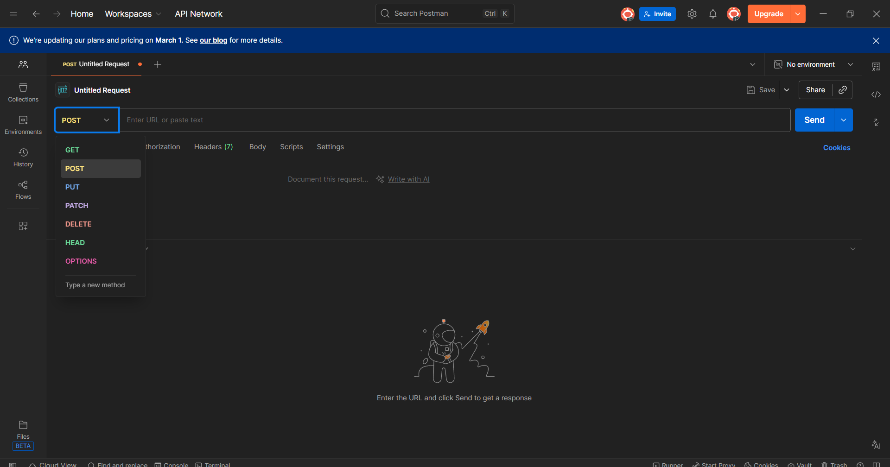
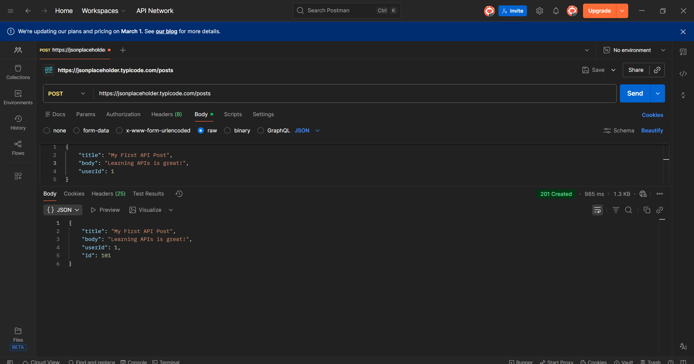

# Day 03: Sending Data with POST Requests

On the third day of my journey, I moved from "reading" data to "creating" it. This step is crucial because it simulates how a client sends information to a server to be stored in a database.

---

## 🌍 English Version

### 🎯 What I Aimed For
The goal for today was to understand the **POST** method and how to send data in the **Request Body** using JSON format. Unlike GET, POST is used to create new resources.

### 1. Method Selection
I opened a new tab in Postman. Since I wanted to send data, I changed the method from `GET` to `POST` using the dropdown menu.



### 2. Setting up the Request (Body & JSON)
I entered the URL `https://jsonplaceholder.typicode.com/posts`. Then, to send data, I had to configure the **Body**:
* **Step:** Clicked on **Body** -> selected **raw** -> chose **JSON** from the dropdown.
* **Data:** I entered the following JSON code:

```json
{
    "title": "My First API Post",
    "body": "Learning APIs with my mentor is great!",
    "userId": 1
}
```

3. Final Result (201 Created)
I clicked Send and checked the status code.

Result: The server returned 201 Created. This confirms that my data was received and a new resource (ID: 101) was created.



🇹🇷 Türkçe Versiyon
<details> <summary><b>Türkçe içeriği okumak için buraya tıklayın (Click to expand)</b></summary>

🎯 Bugünün Amacı
Bugün POST metodunu anlamayı ve Request Body (İstek Gövdesi) kullanarak JSON formatında veri göndermeyi hedefledim. GET'in aksine, POST yeni bir kaynak oluşturmak için kullanılır.

###1. Metot Seçimi
Postman'de yeni bir sekme açtım. Veri göndermek istediğim için açılır menüden metodu GET yerine POST olarak değiştirdim.


2. İsteği Hazırlama (Gövde ve JSON)
Adres çubuğuna https://jsonplaceholder.typicode.com/posts yazdım. Ardından veriyi hazırlamak için Body ayarlarını yaptım:

Adım: Body sekmesine tıkladım -> raw seçeneğini işaretledim -> listeden JSON formatını seçtim.

Veri: Aşağıdaki JSON kodunu yazdım:

JSON
{
    "title": "My First API Post",
    "body": "Learning APIs with my mentor is great!",
    "userId": 1
}

3. Sonuç (201 Created)
Send butonuna bastım ve durum kodunu kontrol ettim.

Sonuç: Sunucu 201 Created yanıtını döndü. Bu, verimin başarıyla alındığını ve yeni bir kaynağın (ID: 101) oluşturulduğunu kanıtladı.


</details>

🏁 Summary of Day 03
Switched from data consumption (GET) to data creation (POST).

Mastered the Request Body and JSON structure.

Confirmed the 201 Created success response with real-world screenshots.